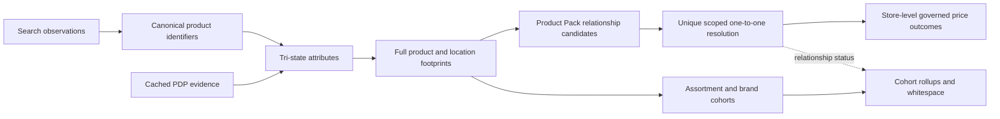

# Phase 10.5 — Matching and Cohort Trust Integrity

## Purpose

This phase separates product identity, product relationships, assortment cohorts, and price
selection so the application cannot present a market-floor offer as if it were a unique product
match. It applies equally to every Product Pack and adds no product-category branch to the core
engine.

## Governed definitions

1. A **product relationship** represents the same sellable product identity under one Product Pack
   comparison profile. Automatic relationships are one-to-one within their applicable benchmark
   location scope. Confirmed relationships may reuse a regional product only across disjoint,
   explicit scopes.
2. A **cohort** is an analytical rollup of products that share configured attributes, brand roles,
   or distribution characteristics. Cohort membership does not create a product relationship and
   cannot authorize a store-level price comparison by itself.
3. A **market-floor observation** is the lowest eligible offer in a configured market/profile. It is
   useful for assortment diagnostics but is not product identity evidence.
4. Store-specific **Search** observations remain authoritative for price and availability. Cached
   **Product Details** may complete identity and attribute evidence before matching, but a PDP price
   never replaces the Search price used in store-level outcomes.

## Trust-critical changes

- Relationship candidate generation preserves every distinct analysis-relevant product instead of
  retaining only the lowest-priced product in a geography/dimension group.
- Automatic candidate resolution uses Product Pack priority, attribute completeness, and review
  state. Evidence volume, price, and stable identifier order never decide product identity.
- A missing claim is `unknown`. Product Pack fallback defaults do not turn an absent claim into
  `false` unless a future version explicitly declares an authoritative `absence_policy`.
- PDP evidence can fill unresolved/defaulted attributes but cannot overwrite explicit Search or
  Product Pack evidence.
- Confirmed pairs are retained even when neither product is the market-floor item.
- Lossy scientific-notation product IDs are recovered from an unambiguous retailer URL token or
  rejected. Rounded IDs are never silently persisted.
- Match Review receives the full in-scope product catalog, not only highlighted or already-matched
  products. Products tied to active relationships remain visible even for older publication
  contexts that lack the full catalog.
- Ambiguous candidate products are separated from true benchmark-only and competitor-only
  whitespace so uncertainty is not reported as assortment opportunity.
- Report comparison bases explicitly state `relationship_resolved_products`; these outcomes must
  not be interpreted as market-floor assortment minima.
- The normative ReportView contract advances to `1.1.0` because `population_basis` is required on
  every comparison basis.
- Processing-volume diagnostics are kept in the assortment audit context, not counted as data
  quality defects.

## Cohort and relationship flow

## Release gates

- Classification tests prove unobserved claims remain unknown and PDP completion respects source
  precedence.
- Adversarial relationship tests prove non-market-floor confirmed products survive, ambiguous
  many-to-one candidates fail closed, and disjoint regional footprints may reuse a product without
  overlap.
- Match Review contract tests prove the complete catalog and every active relationship are visible.
- Exact historical golden suites must pass for ground beef, strawberries, milk, bananas, and the
  14-retailer egg dataset before deployment.
- Python format, lint, static typing, all unit/integration tests, generated contracts, web tests,
  TypeScript checks, and the production web build must pass.

## Deferred, separately governed work

- Explicit negative-claim terms such as `conventional` or `unflavored` belong in newly versioned
  Product Packs. Published Product Pack files are never mutated in place.
- Market-floor assortment analytics may be exposed as a separate view later. If added, its labels,
  metrics, and evidence must remain distinct from relationship-resolved outcomes.
- Reanalysis and publication remain user-triggered. Saving, confirming, rejecting, or undoing a
  relationship does not automatically re-run an analysis.
